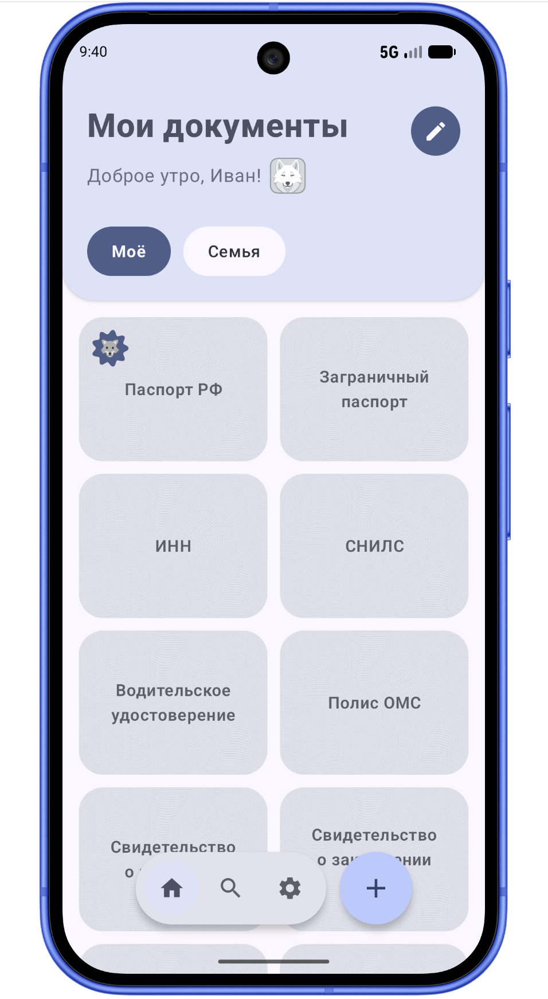
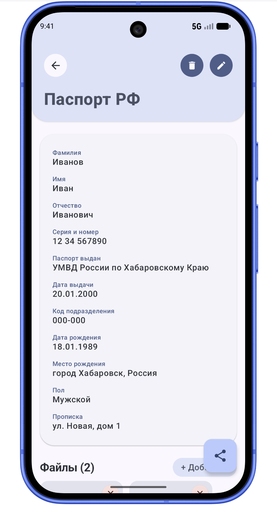
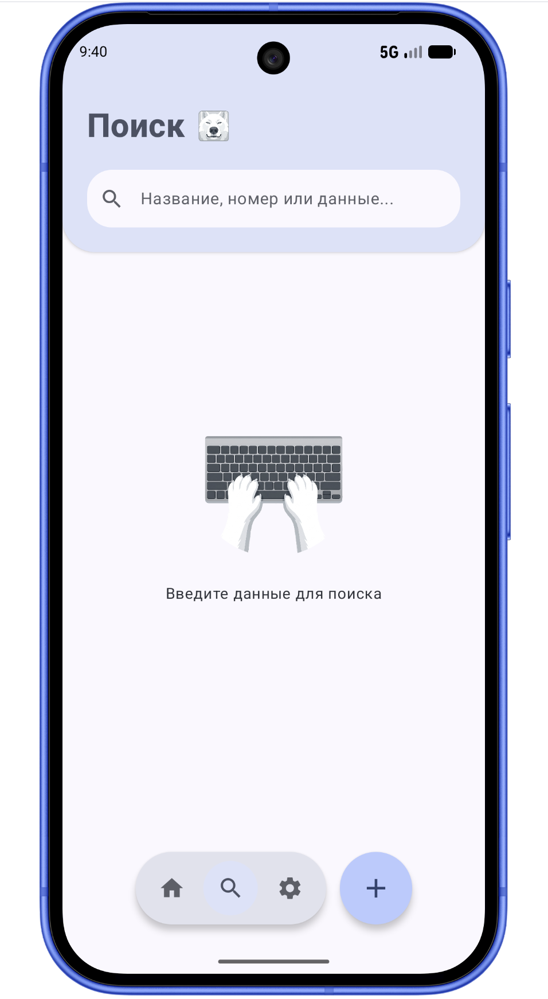
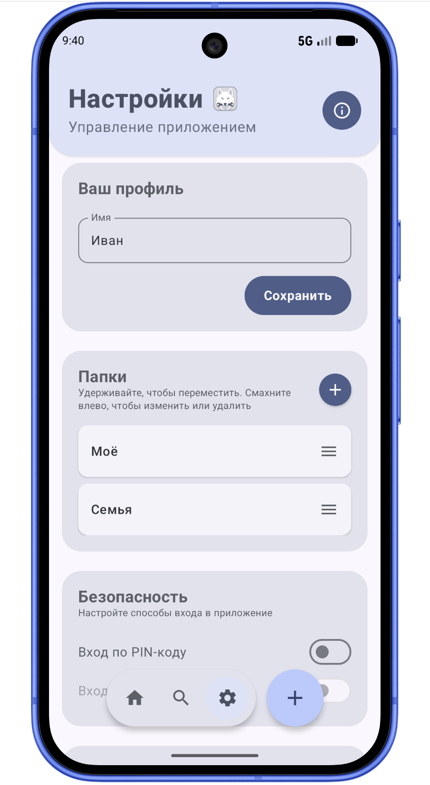

# 📁 Мои Документы

Современное, надежное и полностью нативное Android-приложение для безопасного локального хранения личных документов и важных данных. Проект разработан на актуальном стеке технологий с акцентом на абсолютную приватность, отзывчивый интерфейс и каноны веб-дизайна Material Design 3 (Material You).

---

## ✨ Главные возможности

* **🔒 Бескомпромиссная безопасность:**
    * Вход защищен ПИН-кодом и биометрическими данными (отпечатком пальца / фейсконтролем).
    * Умный тайм-аут блокировки. Автоматическое закрытие базы данных, если приложение свернуто более 2 минут (с корректной обработкой "холодного" и "теплого" старта).
    * **100%** локальное хранение данных на устройстве без использования сторонних серверов.
* **🎨 Удобный UX/UI и бесшовная навигация:**
    * **Интуитивные свайпы:** переключение между ключевыми экранами реализовано через плавный жест перелистывания всей страницы.
    * **Парящий таббар:** нижняя панель управления с интерактивной кареткой, которая мягко перетекает между иконками вслед за пальцем пользователя.
    * **Живой маскот:** интерактивный волк-хранитель со скромным именем **ВОЛЧАРА** в шапке приложения и не только, реагирующий на тапы случайными ободряющими фразами.
* **🗂 Гибкое управление контентом:**
    * Динамическое создание пользовательских папок.
    * Поддержка продвинутых жестов: **Drag & Drop** для изменения порядка папок долгим нажатием и **Swipe-to-Reveal** для быстрого редактирования или удаления.
* **💾 Резервное копирование (Backup & Restore):**
    * Экспорт всей локальной базы данных и связанных файлов в зашифрованный паролем ZIP-архив.
    * Безопасное восстановление данных из резервной копии с автоматической перезагрузкой сессии Room Database.
* **🌈 Персонализация:** поддержка светлой, темной и системной тем оформления, а также динамических цветов **Material You**.

---

## 📱 Экраны приложения (смартфон)

### 1. Главный экран 
Отображает интерактивную ленту созданных папок и сетку документов внутри них. Здесь пользователя встречает анимированный маскот приложения. Документы защищены уникальной текстурой защитной сетки (гильош) для предотвращения визуального считывания.

### 2. Просмотр документа
Экран детальной информации, адаптирующийся под конкретный тип документа (паспорт, СНИЛС, ИНН и другие, а также кастомный шаблон). Позволяет просматривать все заполненные поля и мгновенно копировать нужные данные (например, номер или серию) в буфер обмена в один тап. Есть возможность прикрепить фото или PDF файл документа.

### 3. Умный поиск
Экран полнотекстового динамического поиска. Фильтрация данных происходит «на лету» по мере ввода символов. Поиск проверяет совпадения не только в названиях документов, но и сканирует содержимое абсолютно всех внутренних полей, экономя время в экстренных ситуациях.

### 4. Настройки
Здесь сосредоточено редактирование профиля пользователя, сортировка папок жестами, тумблеры управления безопасностью (активация ПИН-кода и биометрии), переключатели тем оформления и утилиты зашифрованного резервного копирования.

  
  

  
  

---

## 📱 Экраны приложения (планшет/fold)

  
  

  
  

---

## 🛠 Технологический стек

* **Language:** [Kotlin](https://kotlinlang.org/) — 100% нативная разработка.
* **UI Framework:** [Jetpack Compose](https://developer.android.com/jetpack/compose) — декларативный реактивный интерфейс.
* **Architecture:** MVVM (Model-View-ViewModel) + Clean Architecture (Data/UI слой).
* **Database:** [Room Database](https://developer.android.com/training/data-storage/room) — объектно-ориентированная надстройка над SQLite.
* **Gestures & Foundations:** Foundation Pager (`HorizontalPager`), Advanced Pointer Input (модификаторы обработки Drag/Swipe/Bounce жестов).
* **Security:** Android Biometric API, Jetpack Lifecycle Observers.
* **Asynchrony:** Kotlin Coroutines & StateFlow (реактивное управление состояниями экранов).

---

## 🚀 Установка

Вы можете установить готовую сборку приложения на свой Android-смартфон:
1. Перейдите в раздел [Releases](../../releases) в правой части этой страницы.
2. Скачайте актуальный файл `DocumentsApp-v1.0.apk`.
3. Откройте файл на устройстве и подтвердите установку (при необходимости разрешите установку из неизвестных источников в настройках браузера).

---

## 📄 Правовая информация

Приложение разработано с заботой о ваших персональных данных. Ознакомиться с правилами обработки и хранения информации можно здесь:
👉 [Политика конфиденциальности](PRIVACY_POLICY.md)